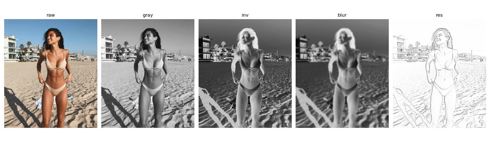

# README

跟微信公众号 **小白学视觉** 写RGB图像转素描图的代码，顺带复习滤波相关知识。

## 过程记述

整个过程如下：

1. 导入图片；
2. 然后将图片转为灰度图；
3. 接着对图片取反；
4. 使用高斯滤波；
5. 颜色减淡混合。

上述过程中第三步进行了取反操作，然后在第五步中又进行了取反操作，所以说假如去掉取反操作也能达成所需效果，但是背景会比较模糊。

如何解释这一点呢？模糊代表滤波前后的结果相差不大，因此可能是高斯滤波对于数值较大的像素影响比较大，这就是使用取反操作的背景亮度损失比较多，再次取反后数值较大，这会使得视觉上清晰度比较好。

最终效果：

## TODO

- [x] 基本代码
- [x] 滤波总结
- [x] argparse