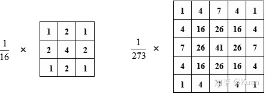
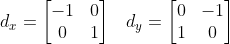
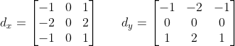
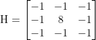

# 高斯滤波

小应用用到了高斯滤波，这里简单学习总结一下高斯滤波函数。

## 高斯滤波简介

高斯滤波是一种线性平滑滤波，适用于消除[高斯噪声](https://baike.baidu.com/item/高斯噪声)，广泛应用于图像处理的减噪过程。

高斯滤波使用高斯核对中心点进行操作。因为高斯卷积操作会在其覆盖范围的中心输出结果，所以高斯卷积核大小为奇数。常用的高斯模板有：


其原始公式如下：
$$
G(x,y) = \frac{1}{2\pi \sigma^2}exp\left \{-\frac{x^2+y^2}{2\sigma^2}\right \}
$$

## 函数接口

OpenCV中[高斯滤波函数接口](https://docs.opencv.org/2.4/modules/imgproc/doc/filtering.html#void%20GaussianBlur%28InputArray%20src,%20OutputArray%20dst,%20Size%20ksize,%20double%20sigmaX,%20double%20sigmaY,%20int%20borderType%29)如下：
```python
cv2.GaussianBlur(src, ksize, sigmaX, sigmaY, borderType)

    src: 输入的图像
    ksize: 高斯卷积核的大小。
           注意：卷积核的高度和宽度都应为奇数，且可以不同
    sigmaX: 水平方向的标准差
    sigmaY: 垂直方向的标准差，默认值为0，表示与sigmaX相同
    borderType: 边界类型
```

几点注意:
- ksize: 卷积核越大，可以去掉越多的噪声，但同时也使得图片变得越来越模糊；
- sigma: 如果 $\sigma$ 过小， 偏离中心的像素权重会非常小，滤波操作会退化为像素的点运算；如果 $\sigma$ 过大，滤波操作会退化为邻域像素的平均操作；
- borderType:
  - 收缩处理范围
  - 使用常数填充
    - BORDER_CONSTANT
  - 复制像素填充 
    - BORDER_DEFAULT 将最近的元素进行映射
    - BORDER_REPLICATE 复制最近一行或者一列
    - BORDER_WRAP 将对面的相素进行映射

## 其他相关知识

### 中值滤波

中值滤波本质上是一种统计排序滤波器。对于原图像中一点，中值滤波以该点为中心的邻域内的统计排序中值作为该点的响应。

中值滤波对于某些类型的随机噪声有非常理想的降噪能力。对于平均平滑滤波（像高斯滤波）而言，在处理的像素邻域之内包含噪声点时，噪声的存在总会影响该点像素值的计算；但在中值滤波中，噪声点常常是被忽略调的；而且同线性平滑滤波器相比，中值滤波在降噪的同时引起的模糊相应最低。

但是作为非线性滤波，中值滤波有可能会改变图像的性质，因而一般不适用于像军事图像处理、医学图像处理等领域。

### 图像锐化

图像锐化和以高斯滤波为代表的图像平滑不同，图像锐化主要用于增强图像的灰度跳变部分。

线性平滑都是基于对图像邻域的积分运算，而锐化则是通过求图像梯度或者有限差分运算得到的。

#### 梯度算子

梯度算子是基于一阶导数的图像增强。

**Robert 交叉梯度**：



Robert算子的模板尺寸为 2x2，使用不太方便。实际中模板尺寸为基数的**Sobel梯度**更为实用：



#### 拉普拉斯算子

拉普拉斯算子是一种基于二阶微分的图像增强，其四邻域模板为：


八邻域模板为：



通过Laplacian算子的模板可以发现：

1. 当邻域内像素灰度相同时，模板的卷积运算结果为0；

2. 当中心像素灰度高于邻域内其他像素的平均灰度时，模板的卷积运算结果为正数；

3. 当中心像素的灰度低于邻域内其他像素的平均灰度时，模板的卷积为负数。对卷积运算的结果用适当的衰弱因子处理并加在原中心像素上，就可以实现图像的锐化处理。

#### 基于一阶、二阶倒数的锐化算子对比

- 一阶导数通常会产生比较宽的边缘
- 二阶导数对于阶跃性边缘中心产生零交叉，而对于屋顶状边缘（细线），二阶导数取极值
- 二阶导数对于细节有比较强的相应

对图像增强而言，基于二阶导数的算子应用更多一些，因为它对于细节相应更强，增强效果也更明显；但是在边缘检测中，基于一阶导数的算子会更多的发挥作用。